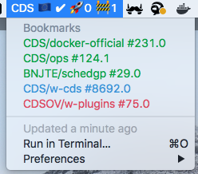

# CDS Bitbar plugin

This repo contains source code of a [Bitbar](https://github.com/matryer/bitbar) plugin to display informations about our builds on [CDS](https://github.com/ovh/cds).



## Installation

In order to let this plugin works you need to download the last release of this plugin in [release section](https://github.com/bnjjj/cds-bitbar/releases) and then put this binary in your bitbar plugins directory.

Pay attention you also need to put a file named `.cds.conf.json` in your current home directory (`$HOME/.cds.conf.json`) and put this inside with your personal data:

```json
{
	"name": "CDS 🇪🇺",
    "host": "https://my_cds_api_url.com",
    "username": "benjamin.coenen",
    "token": "XXX-XXX-XXX-XXX-XXX",
    "insecure_skip_verify_tls": false
}

```

>If you don't know how to obtain a token from CDS please take a look at [their documentation](https://ovh.github.io/cds/cli/cdsctl/login/) using `--env` flag. 


Roadmap:

- [ ] Add native notifications
- [ ] Use good sdk dependencies
- [ ] Add support of native keychain